# Spring Generate


## 一、介绍

``Spring Generate``是一款基于**Tauri**和**Antd**开发的**非侵入式 Spring 项目代码生成器**，他可以为你完成所有的**非定制业务**场景下的功能。目的是为了能够减少开发过程中一些重复的工作。

**Spring Generate 工具生成的内容**

这个工具可以根据您配置的数据结构内容，生成对应的**表结构**，**Controller**，**Mapper**，**Service**，**Entity**，**Exception**和**数据库字典**，如下所示。



> [!Tip]
>
> 在生成的**Controller**，**Mapper**，**Service**，**Entity**，**Exception**中将会内置大量的数据库操作代码，涵盖了大部分的增删改查功能，同时在**Controller**中，会生成相应的增删改查接口。

## 二、平台

* Windows： :white_check_mark:
* Mac OS：​ :white_check_mark:
* Linux：​ :interrobang:（我们没有在这个平台中做过测试，故此标注不明确的支持程度）

## 三、运行

### 1、运行

#### 编译运行

这个软件需要使用**Node**，**Rust**和**Tauri**环境，请您分别按照《[Node.js — Run JavaScript Everywhere (nodejs.org)](https://nodejs.org/en)》，《[Rust 程序设计语言 (rust-lang.org)](https://www.rust-lang.org/zh-CN/)》和《[Build smaller, faster, and more secure desktop applications with a web frontend | Tauri Apps](https://tauri.app/zh-cn/)》搭建开发边境，并安装**Node**包管理器**Yarn**。

这一切就绪后，您可以将本仓库的代码克隆到本地，并通过以下命令启动。

**Debug 模式运行**

```text
yarn
yarn tauri dev
```

**Release模式发行**

```text
yarn
yarn tauri build
```

#### 直接运行

您可以通过我们提供的**release**包来完成下载安装，请点击**右侧的release**来下载最新版本。

### 2、启动软件

我们启动软件，看到如下界面，表示启动成功。


接下来，我们将通过一个项目案例，来为您完成工具的使用讲解以及原理讲解。

## 四、开始

我们以**项目**为主题，构建一个**Spring Generate工程**。假设我们有一个项目名为“UserProject”，项目目录如下所示。

> [!Note]
>
> 我们在这里说的项目指的是**Spring Genreate项目**，而不是**Spring Boot项目**，请不要混淆。

```text
UserProject
│
├─ gradle
├─ src
│  ├─ main
│  └─ test
├─ .gitignore
├─ build.gradle
├─ gradlew
├─ gradlew.bat
├─ HELP.md
└─ settings.gradle
```

这看起来是一个非常普通的Spring Boot项目工程，当前我们的关注点在整个项目工程中，而接下来，我们的关注点将会是在**src**目录下，因为我们所有的工作都是在这个目录下完成。

### 1、新建项目

#### （1）、项目设置


在这个页面中，我们提供了一些需要主动设置的配置内容。其中**“项目名称”**，**“项目包名”**，**“项目路径”**为必填项。

> [!Note]
>
> “项目包名”最好和Spring Boot项目的包名一致，这样可以少配置``MapperScan``扫描的路径。
>
> “项目路径”需要选择项目根目录下的**build.gradle**，或者**pom.xml**，这分别对应了**Gradle项目**和**Mavem项目**。请按照您实际项目的构建类型选择。

#### （2）、数据库


在这个页面中需要配置您项目的数据库连接。目前我们只支持**MySQL**引擎和**MyBatis Plus**的ORM框架。配置完成后可以点击**测试连接**来检查数据库连接是否正常。

> [!Tip]
>
> 后期我们将逐步接入"TiDB"，“MyBatis Flex”，“JPA”，“InfluxDB”等相关的支持。

#### （3）、代码生成


这是创建项目的最后一步：配置项目的代码生成规则。

* **数据库字段大写**：

  * **默认**：生成器不处理Java类映射到数据库的字段名大小写

    ```java
    // 在Java类配置中
    public class User{
        
        @TableField("userName")
        private String userName;
        
    }
    ```

    ```text
    -- 在SQL中的字段名
    
    ----------------------------------
    |    字段名    |      数据类型      |
    ----------------------------------
    |   userName  |      VARCHAR      |
    ----------------------------------
    ```

  * **全大写**：生成器会将Java类映射到数据库的字段名全更改为大写

    ```java
    // 在Java类配置中
    public class User{
        
        @TableField("USERNAME")
        private String userName;
        
    }
    ```

    ```text
    -- 在SQL中的字段名
    
    ----------------------------------
    |    字段名    |      数据类型      |
    ----------------------------------
    |   USERNAME  |      VARCHAR      |
    ----------------------------------
    ```

  * **全小写**：生成器会将Java类映射到数据库的字段名全更改为小写

    ```java
    // 在Java类配置中
    public class User{
        
        @TableField("suername")
        private String userName;
        
    }
    ```

    ```text
    -- 在SQL中的字段名
    
    ----------------------------------
    |    字段名    |      数据类型      |
    ----------------------------------
    |   username  |      VARCHAR      |
    ----------------------------------
    ```

* **数据库字段前缀**：

  这个配置会影响**表结构名称**和**字段名称**的命名规则。如果我们设置前缀为“UP_”，那么在生成时，结果如下所示。

  ```java
  @TableName("UP_USER")
  public class User{
      
      @TableField("UP_USERNAME")
      private String userName;
      
  }
  ```

  ```text
  -- 在SQL中的字段名
  
  ----------------------------------
  |    字段名    |      数据类型      |
  ----------------------------------
  | UP_USERNAME |      VARCHAR      |
  ----------------------------------
  
  -- 表结构名称
  UP_USER
  ```

* **生成时备份**：

  这个配置会影响在生成代码时是否备份旧的代码文件。

  例如我们在生成``UserController``，但是目录下已经存在一个``UserController``文件了，如果选择备份文件，我们会将已经存在的``UserController``重命名做备份，然后再将新的文件写入；否则会直接覆盖写入。


> [!Warning]
>
> 无论这里的生成时备份是否开启，我们在生成数据库表结构的时候，都会将已经存在的且冲突的表重命名做备份。


* **分页页码字段**：

  这个字段会影响生成的**select**接口参数。

  在生成接口时，会生成一个**分页查询**接口，这个接口需要一个**分页页码字段**，这个字段的名称将会在这里配置。

  ```java
  // 查询接口的参数
  class SelectParams{
      
      // 分页页码
      public Integer page;
      
  }
  ```

* **分页数据长度字段**：

  这个字段与“分页页码字段”组合使用，用于表示按照**dataSize**来分页。

  ```java
  // 查询接口的参数
  class SelectParams{
      
      // 分页页码
      public Integer page;
      
      // 数据长度
      public Integer dataSize;
      
  }
  ```

#### （4）、完成

全部配置好后，点击**创建项目**，完成项目的创建。您可以在这个页面再次检查配置是否符合您的要求。

项目创建成功后，软件会退回到**欢迎页面**，此时观察您的**Spring Boot项目src的目录**，会变成如下所示的结构。

```text
UserProject
│
└─ src
   ├─ main
   │  ├─ expands
   │  ├─ main
   │  └─ test
   └─ test
```

其中，main和test都是Spring Boot项目默认创建的，而**expands**是**Spring Generate**工具创建的，您所配置的所有内容，都是被存储到这个目录中。我们现在只需要关注**expands**目录。

```text
expands
│
└─ SpringGenerate
   ├─ document
   ├─ sql
   ├─ src
   └─ project.sg.json
```

* **SpringGenerate**：
  * **document**：数据库字段存储目录
  * **sql**：数据库表结构SQL语句存放目录
  * **src**：表结构定义的存放目录
  * **project.sg.json**：项目配置文件

### 2、打开项目

> [!Note]
>
> 2134234234
>
> 1242
>
> 34
>
> 23
>
> 42

**发行日志**

> 1.0.0-patch-2
>
> * 修复了一些问题
>
> 1.0.0-patch-1
>
> * 修复了编辑字段发生的错误
> * 增加了字段名称的合法性检查
>
> 1.0.0
>
> 2024年5月7日
>
> * 提交代码，发布程序
